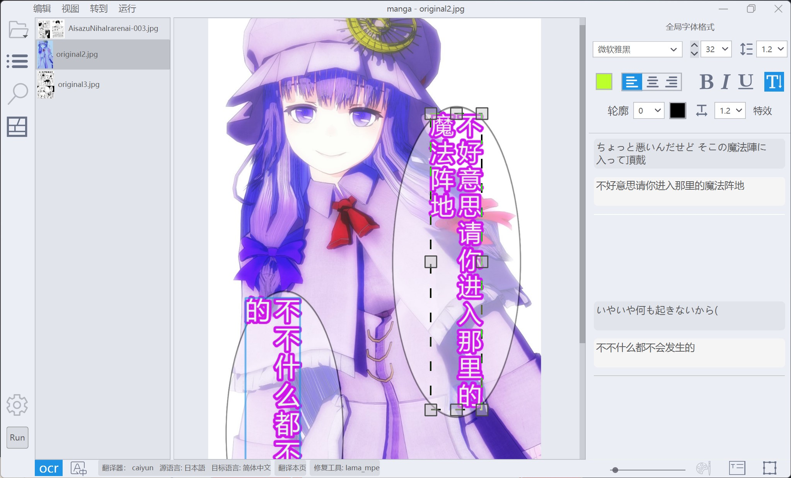
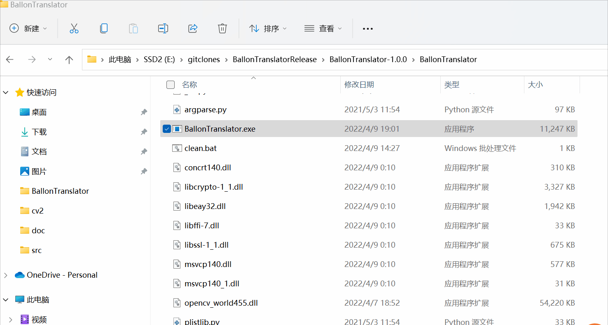
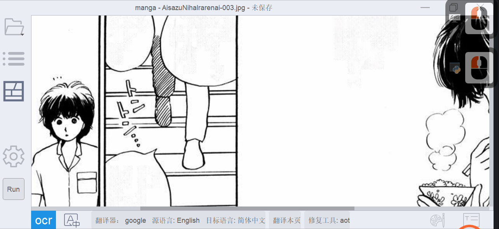
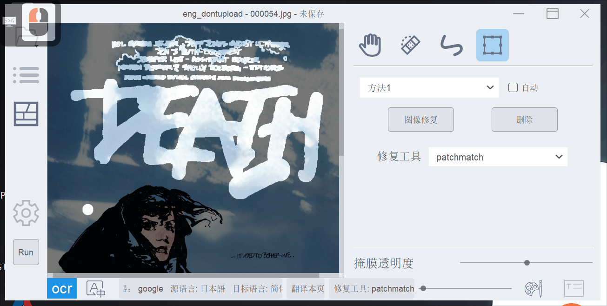
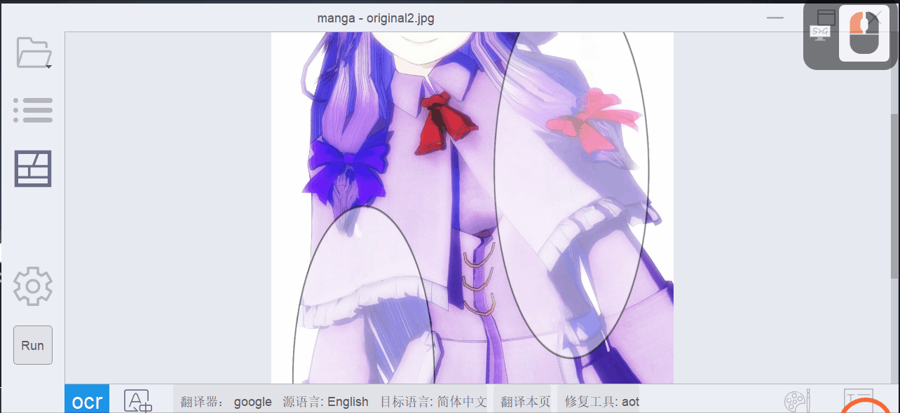
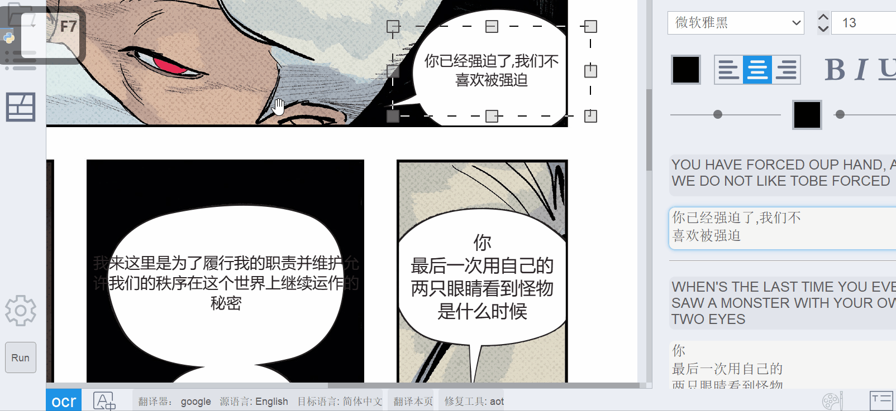
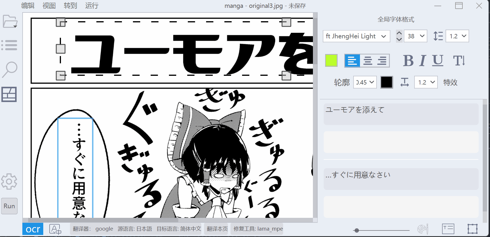
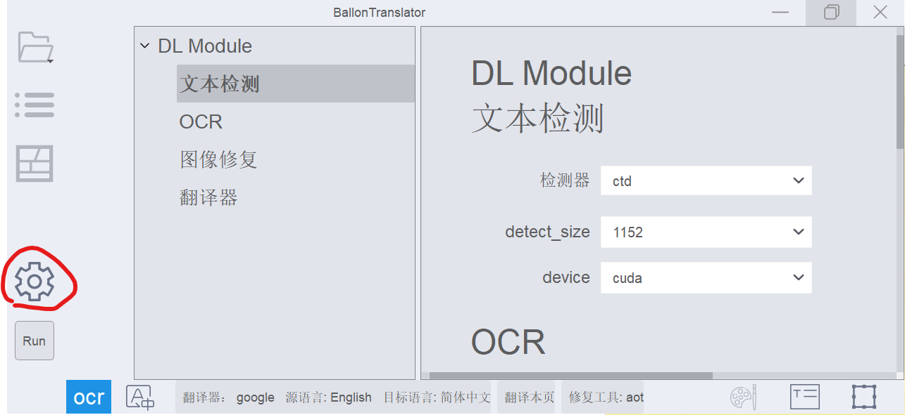

> [!IMPORTANT]  
> **Si vous partagez publiquement le résultat traduit et qu'aucun traducteur humain expérimenté n'a participé à la traduction ou à la relecture, veuillez indiquer clairement qu'il s'agit d'une traduction automatique.**

# BallonTranslator
[简体中文](/README.md) | [English](/README_EN.md) | [pt-BR](../doc/README_PT-BR.md) | [Русский](../doc/README_RU.md) | [日本語](../doc/README_JA.md) | [Indonesia](../doc/README_ID.md) | [Tiếng Việt](../doc/README_VI.md) | [한국어](../doc/README_KO.md) | [Español](../doc/README_ES.md) | Français

BallonTranslator est un autre outil assisté par ordinateur, basé sur l'apprentissage profond (deep learning), permettant de traduire des comics/mangas.



<p align=center>
aperçu
</p>

Prend en charge le formatage riche du texte et les préréglages de style. Les textes traduits peuvent être édités interactivement.

Prend en charge rechercher & remplacer

Prend en charge l’export/import vers/depuis des documents Word

# Fonctionnalités
* Traduction entièrement automatisée
  - Prend en charge la détection, la reconnaissance, la suppression et la traduction automatiques du texte. Les performances globales dépendent de ces modules.
  - La composition typographique est basée sur l'estimation du formatage du texte original.
  - Fonctionne correctement avec les mangas et comics.
  - Amélioration du lettrage manga->Anglais, Anglais->Chinois (basé sur l'extraction des zones de bulles).
  
* Édition d’image  
  - Prise en charge de l'édition et de la retouche des masques (similaire à l'outil Pinceau correcteur dans Photoshop)
  - Adapté aux images à rapport hauteur/largeur extrême comme les webtoons
  
* Édition de texte
  - Prend en charge le formatage riche du texte et les [préréglages de style](https://github.com/dmMaze/BallonsTranslator/pull/311). Les textes traduits peuvent être édités interactivement.
  - Prend en charge rechercher & remplacer
  - Prend en charge l’export/import vers/depuis des documents Word

# Installation

## Sous Windows
Si vous ne souhaitez pas installer Python et Git vous-même et que vous avez accès à Internet :
Téléchargez BallonsTranslator_dev_src_with_gitpython.7z depuis [MEGA](https://mega.nz/folder/gmhmACoD#dkVlZ2nphOkU5-2ACb5dKw) ou [Google Drive](https://drive.google.com/drive/folders/1uElIYRLNakJj-YS0Kd3r3HE-wzeEvrWd?usp=sharing), décompressez et lancez launch_win.bat. 
Exécutez scripts/local_gitpull.bat pour obtenir la dernière mise à jour.
Notez que ces paquets fournis ne fonctionnent pas sous Windows 7, les utilisateurs de Win7 doivent installer [Python 3.8](https://www.python.org/downloads/release/python-3810/) et exécuter le code source.

## Exécuter le code source

Installez [Python](https://www.python.org/downloads/release/python-31011) **<= 3.12** (ne pas utiliser celui du Microsoft Store) et [Git](https://git-scm.com/downloads).

```bash
# Clonez ce dépôt
$ git clone https://github.com/dmMaze/BallonsTranslator.git ; cd BallonsTranslator

# Lancez l'application
$ python3 launch.py

# Mettre à jour l'application
$ python3 launch.py --update
```

Lors du premier lancement, le programme installera automatiquement les bibliothèques requises et téléchargera les modèles. Si les téléchargements échouent, il faudra récupérer le dossier **data** (ou les fichiers manquants indiqués dans le terminal) depuis [MEGA](https://mega.nz/folder/gmhmACoD#dkVlZ2nphOkU5-2ACb5dKw) ou [Google Drive](https://drive.google.com/drive/folders/1uElIYRLNakJj-YS0Kd3r3HE-wzeEvrWd?usp=sharing) et les placer au bon endroit dans le dossier du code source.

## Construire l'application macOS (compatible Intel et puces Apple Silicon)
[Reference](../doc/macOS_app.md)  
Quelques problèmes peuvent survenir, exécuter directement le code source est pour l’instant recommandé.

<i>Remarque : macOS peut également exécuter le code source si l'application ne fonctionne pas.</i>


#### 1. Préparation
-   Téléchargez les bibliothèques et les modèles depuis [MEGA](https://mega.nz/folder/gmhmACoD#dkVlZ2nphOkU5-2ACb5dKw "MEGA") ou [Google Drive](https://drive.google.com/drive/folders/1uElIYRLNakJj-YS0Kd3r3HE-wzeEvrWd?usp=sharing)


-  Placez toutes les ressources téléchargées dans un dossier nommé data. L'arborescence finale des dossiers doit ressembler à ceci :

```
data
├── libs
│   └── patchmatch_inpaint.dll
└── models
    ├── aot_inpainter.ckpt
    ├── comictextdetector.pt
    ├── comictextdetector.pt.onnx
    ├── lama_mpe.ckpt
    ├── manga-ocr-base
    │   ├── README.md
    │   ├── config.json
    │   ├── preprocessor_config.json
    │   ├── pytorch_model.bin
    │   ├── special_tokens_map.json
    │   ├── tokenizer_config.json
    │   └── vocab.txt
    ├── mit32px_ocr.ckpt
    ├── mit48pxctc_ocr.ckpt
    └── pkuseg
        ├── postag
        │   ├── features.pkl
        │   └── weights.npz
        ├── postag.zip
        └── spacy_ontonotes
            ├── features.msgpack
            └── weights.npz

7 dossiers, 23 fichiers
```

-  Installez l’outil en ligne de commande pyenv pour gérer les versions de Python. Il est recommandé de l’installer via Homebrew.
```
# Installation via Homebrew
brew install pyenv

# Installation via le script officiel
curl https://pyenv.run | bash

# Configuration de l'environnement shell après installation
echo 'export PYENV_ROOT="$HOME/.pyenv"' >> ~/.zshrc
echo 'command -v pyenv >/dev/null || export PATH="$PYENV_ROOT/bin:$PATH"' >> ~/.zshrc
echo 'eval "$(pyenv init -)"' >> ~/.zshrc
```


#### 2、Construire l'application
```
# Se placer dans le répertoire de travail `data`
cd data

# Cloner la branche `dev` du dépôt
git clone -b dev https://github.com/dmMaze/BallonsTranslator.git

# Entrer dans le répertoire `BallonsTranslator`
cd BallonsTranslator

# Lancer le script de construction, demandera le mot de passe lors de l'étape pyinstaller, entrez le mot de passe et validez
sh scripts/build-macos-app.sh
```
> 📌L'application empaquetée se trouve dans ./data/BallonsTranslator/dist/BallonsTranslator.app. Glissez l'application dans le dossier Applications de macOS pour l’installer. Prête à l’emploi sans configuration Python supplémentaire.
</details> 

# Utilisation

**Il est conseillé de lancer le programme dans un terminal pour voir les messages en cas de plantage, voir le gif suivant.**
  
- La première fois que vous lancez l'application, veuillez sélectionner le traducteur et définir les langues source et cible en cliquant sur l'icône des paramètres.
- Ouvrez un dossier contenant les images du manga/manhua/manhwa/comic à traduire en cliquant sur l’icône dossier.
- Cliquez sur le bouton `Run` et attendez la fin du processus.

Les formats de police, tels que la taille et la couleur, sont déterminés automatiquement par le programme au cours de ce processus. Vous pouvez prédéfinir ces formats en modifiant les options correspondantes de « Déterminer par programme » à « Utiliser les paramètres globaux » dans le panneau de configuration -> Composition typographique. (Les paramètres globaux sont les formats affichés dans le panneau de format de police de droite lorsque vous ne modifiez aucun bloc de texte dans la scène.)

## Édition d’image

### Outil de retouche

<p align = "center">
Mode d'édition d'image, outil de retouche
</p>

### Outil Rect

<p align = "center">
Outil Rect
</p>

Pour « effacer » les résultats indésirables de la retouche, utilisez l'outil de retouche ou l'outil de correction en maintenant le **clic droit** enfoncé.
Le résultat dépend de la précision avec laquelle l'algorithme (méthode 1 et méthode 2 dans le gif) extrait le masque de texte. Il peut être moins performant sur des textes et des arrière-plans complexes.  

## Édition de texte

<p align = "center">
Mode édition de texte
</p>


<p align=center>
Formatage de texte en lot & auto-mise en page
</p>


<p align=center>
OCR & traduction d’une zone sélectionnée
</p>

## Raccourcis
* ```A```/```D``` ou ```pageUp```/```Down``` pour changer de page.
* ```Ctrl+Z```, ```Ctrl+Shift+Z``` pour annuler/rétablir la plupart des opérations. (Remarque : la pile d'annulation sera effacée après avoir changé de page.)
* ```T``` pour le mode édition de texte (ou le bouton "T" en bas).
* ```W``` pour activer le mode de création de blocs de texte, cliquez avec le clic droit de la souris sur le canevas et faites glisser la souris pour ajouter un nouveau bloc de texte. (voir le gif sur l'édition de texte)
* ```P``` pour le mode édition d’image.
* En mode édition d'image, utilisez le curseur en bas à droite pour contrôler la transparence de l'image d'origine.
* Désactivez ou activez les modules automatiques via la barre de titre->Exécuter. L'exécution avec tous les modules désactivés réécrira et réaffichera tout le texte en fonction des paramètres correspondants.
* Définissez les paramètres des modules automatiques dans le panneau de configuration.
* ```Ctrl++```/```Ctrl+-``` (Aussi ```Ctrl+Shift+=```) pour redimensionner l’image.
* ```Ctrl+G```/```Ctrl+F``` pour faire une recherche globale/dans la page actuelle.
* ```0-9``` pour ajuster l'opacité du calque de texte.
* Pour l'édition de texte : gras - ```Ctrl+B```, souligné - ```Ctrl+U```, italique - ```Ctrl+I``` 
* Définissez l'ombre et la transparence du texte dans le panneau Style de texte -> Effet.
* ```Alt+Touches fléchées``` ou ```Alt+WASD``` (```pageDown``` ou ```pageUp``` en mode édition de texte) pour passer d'un bloc de texte à l'autre.
  


## Mode sans interface (exécution sans interface graphique)
``` python
python launch.py --headless --exec_dirs "[DIR_1],[DIR_2]..."
```
Notez que la configuration (langue source, langue cible, modèle de retouche, etc.) sera chargée à partir du fichier config/config.json.  
Si la taille de la police rendue n'est pas correcte, spécifiez manuellement la résolution logique via ```--ldpi ```, les valeurs typiques sont 96 et 72.


# Modules d'automatisation
Ce projet dépend fortement de [manga-image-translator](https://github.com/zyddnys/manga-image-translator), un service en ligne et la formation des modèles n'est pas bon marché, veuillez envisager de faire un don au projet :
- Ko-fi: <https://ko-fi.com/voilelabs>
- Patreon: <https://www.patreon.com/voilelabs>
- 爱发电: <https://afdian.net/@voilelabs>  

[Sugoi translator](https://sugoitranslator.com/) est créé par [mingshiba](https://www.patreon.com/mingshiba).
  
## Détection de texte
 * Prise en charge de la détection de texte en anglais et en japonais. Le code source et plus de détails sont disponibles sur [comic-text-detector].
 * Prise en charge de la détection de texte à partir de [Starriver Cloud (Tuanzi Manga OCR)](https://cloud.stariver.org.cn/). Le nom d'utilisateur et le mot de passe doivent être renseignés, et la connexion automatique sera effectuée à chaque lancement du programme.

   * Pour obtenir des instructions détaillées, consultez le [Manuel TuanziOCR](../doc/Manual_TuanziOCR_FR.md)
 
 * Les Modèles`YSGDetector` sont entraînés par [lhj5426](https://github.com/lhj5426), filtrent les onomatopées dans CGs/mangas. Téléchargez depuis [YSGYoloDetector](https://huggingface.co/YSGforMTL/YSGYoloDetector) et placez dans `data/models`. 


## OCR
 * Les modèles mit* viennent de manga-image-translator, prennent en charge l’anglais, japonais, coréen et l’extraction de couleur du texte.
 * [manga_ocr](https://github.com/kha-white/manga-ocr) est un logiciel de reconnaissance de texte japonais développé par [kha-white](https://github.com/kha-white), principalement destiné aux mangas japonais.
 * Prise en charge de la reconnaissance optique de caractères (OCR) via [Starriver Cloud (Tuanzi Manga OCR)](https://cloud.stariver.org.cn/). Le nom d'utilisateur et le mot de passe doivent être renseignés, et la connexion automatique s'effectuera à chaque lancement du programme.
   * L’implémentation actuelle applique l’OCR sur chaque bloc, plus lente et pas plus précise, non recommandée. Préférez Tuanzi Detector.
   * Lorsque vous utilisez le Tuanzi Detector pour la détection de texte, il est recommandé de définir OCR sur none_ocr afin de lire directement le texte, ce qui permet de gagner du temps et de réduire le nombre de requêtes.
   * Pour obtenir des instructions détaillées, consultez le [Manuel TuanziOCR](../doc/Manual_TuanziOCR_FR.md)
* Ajouté en option sous forme de module PaddleOCR. En mode débogage, un message vous indiquera qu'il n'est pas présent. Vous pouvez simplement l'installer en suivant les instructions qui y sont décrites. Si vous ne souhaitez pas installer le paquet vous-même, il vous suffit de décommenter (supprimer le `#`) les lignes contenant paddlepaddle(gpu) et paddleocr. Tout cela se fait à vos propres risques et périls. Pour moi (bropines) et deux testeurs, tout s'est bien installé, mais vous pourriez rencontrer une erreur. Signalez-la dans le ticket et identifiez-moi.
* Ajouté [OneOCR](https://github.com/b1tg/win11-oneocr). Modèle WINDOWS local provenant des applications SnippingTOOL ou Win.PHOTOS. Pour l'utiliser, vous devez placer les fichiers du modèle et les fichiers DLL dans le dossier « data/models/one-ocr ». Avant de lancer le programme, il est préférable de copier tous les fichiers en une seule fois. Pour savoir comment trouver et obtenir les fichiers DLL et les fichiers de modèle, consultez : https://github.com/dmMaze/BallonsTranslator/discussions/859#discussioncomment-12876757 . Merci à AuroraWright pour le projet [OneOCR](https://github.com/AuroraWright/oneocr)

## Retouche
  * AOT provient de [manga-image-translator](https://github.com/zyddnys/manga-image-translator).
  * Tous les lama* sont affinés à l'aide de [LaMa](https://github.com/advimman/lama)
  * PatchMatch est un algorithme issu de [PyPatchMatch](https://github.com/vacancy/PyPatchMatch), ce programme utilise une [version modifiée](https://github.com/dmMaze/PyPatchMatchInpaint)
  
## Translators
* **Vous trouverez des informations sur les modules Traducteurs [ici](../doc/modules/translators.md).**

## FAQ & Divers
* Si vous avez une carte Nvidia ou une puce Apple, l’accélération matérielle sera activée.
* Ajout de la prise en charge de [saladict](https://saladict.crimx.com) (*Dictionnaire contextuel et traducteur de pages professionnel tout-en-un*) dans le mini-menu lors de la sélection de texte. [Guide d'installation](../doc/saladict_fr.md)
* Accélérez les performances si vous disposez d'un périphérique [NVIDIA's CUDA](https://pytorch.org/docs/stable/notes/cuda.html) ou [AMD's ROCm](https://pytorch.org/docs/stable/notes/hip.html), car la plupart des modules utilisent [PyTorch](https://pytorch.org/get-started/locally/).
* Les polices proviennent des polices de votre système.
* Merci à [bropines](https://github.com/bropines) pour l'adaptation en russe.
* Ajout du script JSX « Export vers Photoshop » par [bropines](https://github.com/bropines). </br> Pour lire les instructions, améliorer le code et simplement explorer son fonctionnement, rendez-vous dans `scripts/export vers Photoshop` -> `install_manual.md`.
